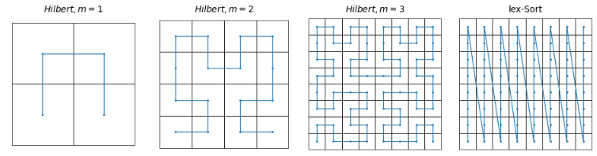

# Canonization

  

This repository contains the experiments for studying canonization and invariant learning across point clouds, image rotations, and neural-network weight spaces.

## Contents

- [Installation](#installation)
- [ModelNet](#modelnet)
  - [Covering Number Experiment](#covering-number-experiment)
  - [Point-Cloud Classification](#point-cloud-classification)
  - [PCA Sign Canonization](#pca-sign-canonization)
- [Rotated MNIST](#rotated-mnist)
- [Deep Weight Spaces](#deep-weight-spaces)