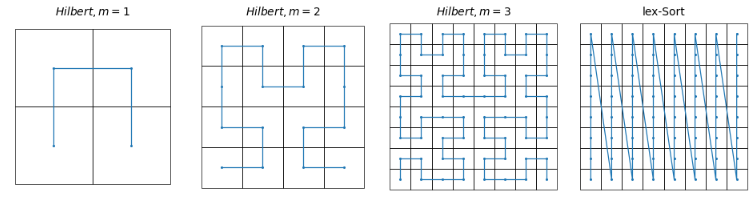

# When and How to Canonize: A Generalization Perspective

**Paper:** [arXiv:2605.11008](https://arxiv.org/abs/2605.11008) · [PDF](https://arxiv.org/pdf/2605.11008)

**Keywords:** canonization, canonicalization, invariant learning, geometric deep learning, group invariance, symmetry, point clouds, ModelNet, Hilbert curves, lexicographic sorting, DeepSets, rotated MNIST, deep weight spaces.

<p align="center">
  
</p>

Official experiment code for **When and How to Canonize: A Generalization Perspective**. It studies canonization and invariant learning across point clouds, image rotations, and neural-network weight spaces, including Hilbert-curve and lexicographic point sorting.

## Contents

- [When and How to Canonize](#when-and-how-to-canonize-a-generalization-perspective)
  - [Contents](#contents)
  - [Installation](#installation)
  - [ModelNet](#modelnet)
    - [Data Setup](#data-setup)
    - [ModelNet classification](#modelnet-classification)
    - [ModelNet rotation and canonization](#modelnet-rotation-and-canonization)
    - [Covering Number Experiment](#covering-number-experiment)
  - [Rotated MNIST](#rotated-mnist)
  - [Deep Weight Spaces](#deep-weight-spaces)
  - [Citation](#citation)
  - [Contact](#contact)

## Installation

Clone the repository:

```bash
git clone https://github.com/yonatansverdlov/Canonization.git
cd Canonization
```

Create and activate the conda environment:

```bash
conda create -n canon python=3.10 -y
conda activate canon
```

Install all required dependencies:

```bash
pip install -r requirements.txt
```
## ModelNet

### Data Setup

Download and prepare the required ModelNet datasets by running:

```bash
python scripts/setup_modelnet.py
```
### ModelNet classification

Two commands run all three models (Hilbert, Lex-Sort, and MLP without sorting)
on ModelNet40 and ModelNet10. Each model runs with seeds 0–4:

```bash
python scripts/run_modelnet_classification.py --dataset 40
python scripts/run_modelnet_classification.py --dataset 10
```

The MLP baseline uses `--ordering ply` internally (the original, unsorted
point order); the other two use `hilbert` and `lex`, respectively. Each
ordering retains its own hyperparameters from
`ModelNet/training/configs/modelnet.json`.

To run only one paper baseline, the original `--ordering hilbert|lex|ply` option
remains available.

#### Optional DeepSets classification baseline

DeepSets reuses **exactly the same residual MLP** as the paper's three
classification baselines (widths `256 → 128 → 64`, same Fourier features,
normalization, dropout, optimizer, and the unsorted-MLP/`ply` training
hyperparameters). Only the first MLP input width changes from
`num_points * d` to `d`, where `d = 3 * num_bands * 2` is the Fourier
feature width for one 3D point. The entire MLP **including its final
classification head** is applied to each point; the per-point class logits
are then summed:

```text
output(S) = sum(MLP(x) for x in S)
```

There is **no averaging, max pooling, or network after the sum**. As with
the unsorted MLP, the input cloud receives the existing per-cloud
normalization before applying the pointwise Fourier map.

Run only DeepSets, using the same five seeds:

```bash
python scripts/run_modelnet_classification.py --dataset 40 --ordering deepsets
python scripts/run_modelnet_classification.py --dataset 10 --ordering deepsets
```

To include DeepSets alongside the three paper baselines in one run:

```bash
python scripts/run_modelnet_classification.py --dataset 40 --include_deepsets
```

The default `--ordering all` still runs the **original three paper
baselines only**. DeepSets uses the same training/evaluation procedure
and reports test accuracy and the train–test generalization gap.

### ModelNet rotation and canonization

Run PurePCA, FrameAveraging, Skewness, and RandomFrame on ModelNet40
with five seeds per model:

```bash
python scripts/run_modelnet_canonization.py
```

The combined results are printed as a table.

### Covering Number Experiment

Run the experiment on ModelNet10:

```bash
python scripts/run_modelnet_covering.py --dataset 10
```

Run the experiment on ModelNet40:

```bash
python scripts/run_modelnet_covering.py --dataset 40
```

The covering distances are printed as a table.

## Rotated MNIST

### Training

```bash
python scripts/run_rotated_mnist.py --model cnn
python scripts/run_rotated_mnist.py --model average
python scripts/run_rotated_mnist.py --model learned_can
python scripts/run_rotated_mnist.py --model frozen_can
```

Each experiment is run over 5 random seeds.

### Distance Computation

```bash
python scripts/run_rotated_mnist_distances.py
```

The experiment reports `l2`, `group`, and `can_frozen`; `can_learned` is also reported when a learned canonization checkpoint is available. The distance computation uses seed `0` by default.

## Deep Weight Spaces

### Data Setup

```bash
python scripts/setup_dws_data.py
```

### Training

MNIST-INR:

```bash
python scripts/run_dws.py --dataset mnist --model mlp
python scripts/run_dws.py --dataset mnist --model can_mlp
python scripts/run_dws.py --dataset mnist --model dwsnet
```

Fashion-MNIST-INR:

```bash
python scripts/run_dws.py --dataset fmnist --model mlp
python scripts/run_dws.py --dataset fmnist --model can_mlp
python scripts/run_dws.py --dataset fmnist --model dwsnet
```

## Reproducibility

Seeded experiments use deterministic Python, NumPy, PyTorch, CUDA, and DataLoader settings where supported. Rotated MNIST `learned_can` is not guaranteed to be bitwise deterministic on CUDA because its Kornia rotation uses CUDA `grid_sample` backward.

## Citation

If you find this code useful, please cite:

```bibtex
@article{sverdlov2026canonize,
  title={When and How to Canonize: A Generalization Perspective},
  author={Sverdlov, Yonatan and Friedman, Benjamin and Hordan, Snir and Dym, Nadav},
  journal={arXiv preprint arXiv:2605.11008},
  year={2026}
}
```

## Contact

For questions, feedback, or collaboration opportunities, feel free to reach out:

📧 **Email:** [yonatans@campus.technion.ac.il](mailto:yonatans@campus.technion.ac.il)

If you encounter issues or have suggestions, please open an issue on the [GitHub repository](https://github.com/yonatansverdlov/Canonization).
